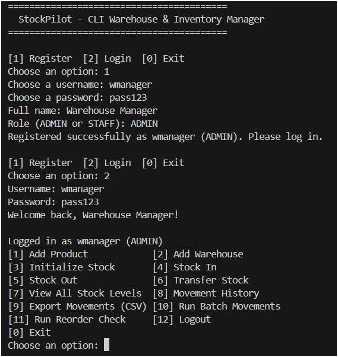
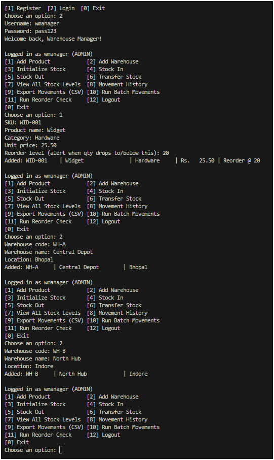
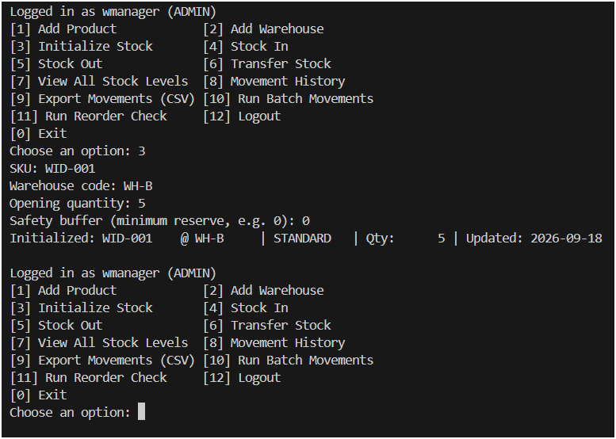
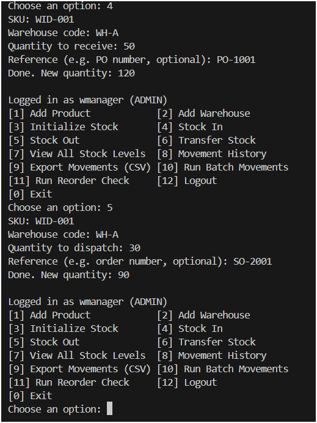
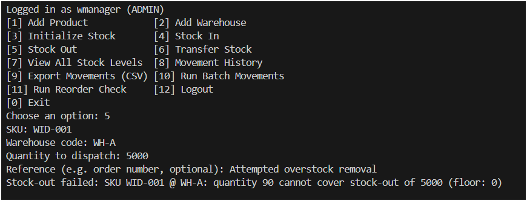
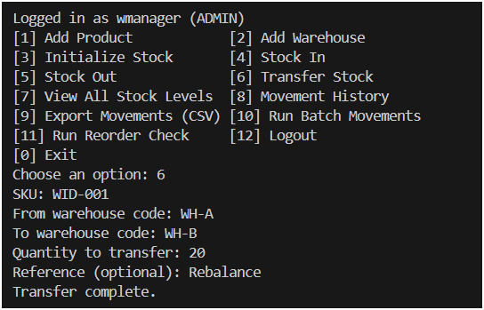
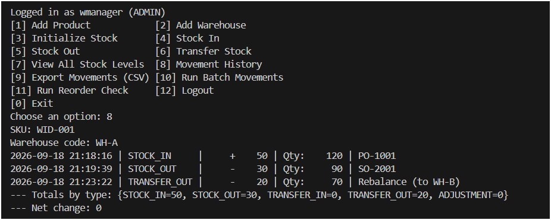
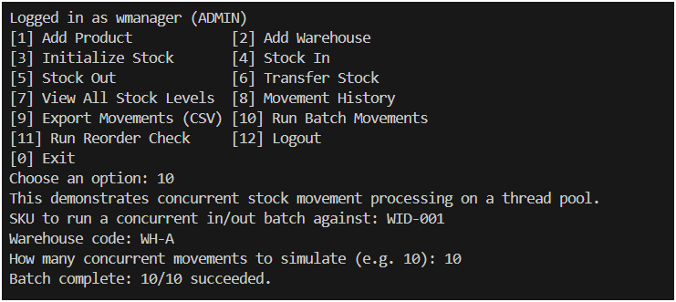
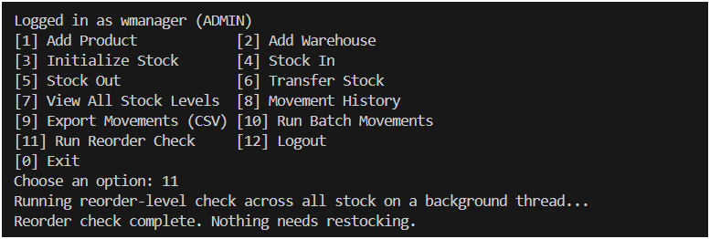
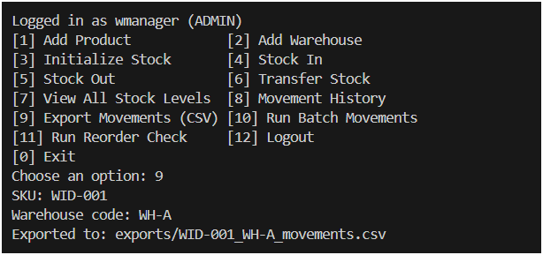

# StockPilot — CLI Inventory & Warehouse Stock Management System

A command-line inventory and multi-warehouse stock management system built for **CSE2006 Programming in Java**. It models a product catalogue, multiple warehouses, per-warehouse stock levels with different floor policies, inbound/outbound/transfer movements, and concurrent order-picking — all backed by a real embedded SQL database.

## Overview

StockPilot lets warehouse staff register, log in, register products and warehouses, initialize and track stock per (product, warehouse) pair, receive and dispatch stock, transfer stock between warehouses, and run two live multithreading demos (a concurrent stock-movement batch and a background reorder-level sweep). Every operation is persisted to a local SQLite database (`data/stockpilot.db`), created automatically on first run — there is nothing to install or configure beyond a JDK and Maven.

## Features

- **Staff accounts** — registration and login with SHA-256 password hashing, ADMIN/STAFF roles
- **Two stock policies** — `StandardStockLevel` (enforces a safety-stock floor, never goes below it) and `BackorderStockLevel` (permits going negative up to a backorder limit), sharing a common abstract `StockLevel` superclass
- **Composite-key persistence** — stock is tracked per (SKU, warehouse) pair, so the same product can have independent stock levels and policies at different warehouses
- **Core inventory operations** — stock-in, stock-out, and inter-warehouse transfer, each fully validated
- **Custom exception hierarchy** — `InsufficientStockException`, `ProductNotFoundException`, `WarehouseNotFoundException`, `InvalidQuantityException`, `DuplicateSkuException`, `AuthenticationException`
- **Thread-safe concurrent stock processing** — a batch of stock movements is submitted to an `ExecutorService` thread pool and applied safely even when multiple threads target the same SKU/warehouse
- **Background reorder-level sweep** — a `Thread` subclass checks every stock line against its product's reorder threshold (via the `Reorderable` interface's default method) and raises alerts
- **File I/O** — an append-only application log (`logs/app.log`) and CSV movement export (`exports/`)
- **JDBC persistence** — all staff, products, warehouses, stock levels, and movements are stored in SQLite via hand-written DAO classes (no ORM magic, so the JDBC mechanics are fully visible)
- **Java Collections & Streams** — movement aggregation (totals by type, net change) uses `EnumMap` and the Streams API

## Technologies Used

| Concern | Technology |
|---|---|
| Language | Java 17+ (developed/tested on JDK 21) |
| Build | Maven |
| Database | SQLite via the `org.xerial:sqlite-jdbc` driver (embedded, file-based — no server to install) |
| Concurrency | `java.util.concurrent` (`ExecutorService`, `ConcurrentHashMap`) and `Thread` |
| I/O | `java.io` (`FileWriter`, `BufferedWriter`, `PrintWriter`) |

## Project Structure

```
stockpilot/
├── pom.xml
├── README.md
├── statement.md
├── data/
│   └── schema.sql              # reference copy of the DB schema
├── src/main/java/com/stockpilot/
│   ├── Main.java                 # entry point
│   ├── cli/WarehouseCLI.java     # menu-driven CLI
│   ├── model/                    # StockLevel hierarchy, Product, Warehouse, enums, interfaces
│   ├── exception/                 # 6 custom checked exceptions
│   ├── dao/                      # JDBC data-access objects + connection manager
│   ├── service/                  # business logic (auth, catalogue, stock, reports)
│   ├── concurrency/                # thread pool batch processor + background reorder thread
│   ├── io/                       # file logger + CSV exporter
│   └── util/                     # input validation, password hashing
```

## Setup & Installation

### Prerequisites
- **JDK 17 or newer** (`java -version` to check)
- **Maven 3.6+** (`mvn -version` to check)

If you don't have Maven, install it from https://maven.apache.org/install.html, or on Ubuntu/Debian: `sudo apt install maven`.

### 1. Clone the repository
```bash
git clone https://github.com/tanishirai/Inventory-Warehouse-Stock-Management-System.git
cd Inventory-Warehouse-Stock-Management-System
```

### 2. Build the project
```bash
mvn clean package
```
This compiles the code, pulls down the SQLite JDBC driver, and produces a single runnable jar at `target/stockpilot.jar` (via the Shade plugin — the driver is bundled in, so nothing else needs to be on the classpath).

### 3. Run it
```bash
java -jar target/stockpilot.jar
```
On first run, StockPilot creates `data/stockpilot.db` and all five tables automatically — no manual database setup needed.

## Using the CLI

You'll see a menu. A typical first session:

1. **Register** — choose a username, password, full name, and role (ADMIN/STAFF)
2. **Login** — with the credentials you just registered
3. **Add Product** — SKU, name, category, unit price, reorder level
4. **Add Warehouse** — a code, name, and location
5. **Initialize Stock** — set an opening quantity and safety buffer for that SKU at that warehouse
6. **Stock In / Stock Out** — receive or dispatch units, with a reference (PO/order number)
7. **Transfer Stock** — move units of a SKU from one warehouse to another
8. **View All Stock Levels** — every (SKU, warehouse) pair and its current quantity
9. **Movement History** — full ledger for one SKU/warehouse, plus totals by type and net change
10. **Export Movements (CSV)** — writes `exports/{sku}_{warehouse}_movements.csv`
11. **Run Batch Movements** — fires N concurrent stock-in/out requests at one SKU/warehouse through a thread pool, to demonstrate that quantities stay correct under concurrency
12. **Run Reorder Check** — a background thread sweeps every stock line and flags anything at or below its reorder level
13. **Logout**

Every failure path (insufficient stock, unknown SKU/warehouse, bad input, duplicate SKU, wrong password) is caught and reported as a clear message rather than a stack trace.

## Testing / Verification

There's no GUI dependency — the entire application is drivable from a terminal, which also makes it easy to verify manually:

1. Run `java -jar target/stockpilot.jar`
2. Register a staff user, add a product and two warehouses, initialize stock for that product at both
3. Stock-in and stock-out at one warehouse, then try to dispatch more than the quantity allows — confirm you get a clean `InsufficientStockException` message, not a crash
4. Transfer stock between the two warehouses and check `View All Stock Levels` for both
5. Run **Run Batch Movements** with a decent count (e.g. 20) against one SKU/warehouse, then check the quantity — it should reflect every operation exactly once (no lost updates)
6. Check `logs/app.log` — every operation you just performed should appear there with a timestamp
7. Export movements and open the resulting CSV in a spreadsheet program
8. Run **Run Reorder Check** after dispatching stock below a product's reorder level and confirm the alert appears

## Screenshots

Sample CLI session showing registration, catalogue setup, stock movements, the concurrency demo, and reporting.

**Registration & login**


**Adding a product and warehouses**


**Initializing stock**


**Stock in / stock out**


**Insufficient stock — exception handling in action**


**Transfer between warehouses**


**Movement history & totals**


**Concurrent batch demo (thread pool)**


**Reorder check (background thread)**


**CSV export**



## Design Notes

- **Why SQLite instead of MySQL/PostgreSQL?** The submission requirement is that the project "must be fully executable via the command line" with no GUI-based setup. An embedded, file-based database means `mvn clean package && java -jar target/stockpilot.jar` is the entire setup — no server to install, no connection string to edit.
- **Concurrency correctness**: reading a fresh `StockLevel` object from the database on every call and `synchronized`-ing on it would not actually prevent races, since two threads would hold two different objects for the same (SKU, warehouse) row. `StockService` keeps a `ConcurrentHashMap<String, StockLevel>` cache keyed by `sku@warehouseCode` so every thread operating on the same stock line synchronizes on the *same* object instance, and persists to SQLite immediately inside that same critical section.
- **Password storage**: passwords are hashed with SHA-256 before storage; plaintext is never persisted. A production system would add per-user salt and a slow KDF (bcrypt/Argon2) — noted here as a deliberate scope cut for a coursework project, not an oversight.

## Future Enhancements

- Per-user salted password hashing (bcrypt/Argon2)
- A scheduled (rather than menu-triggered) reorder-check job using `ScheduledExecutorService`
- A JPA/Hibernate entity mapping layer as an alternative to the hand-written JDBC DAOs, to compare ORM vs. raw JDBC directly
- Supplier/purchase-order tracking layered on top of the existing stock-in flow
- A REST API wrapper around the service layer for a future web/mobile client
