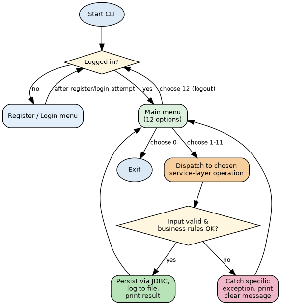
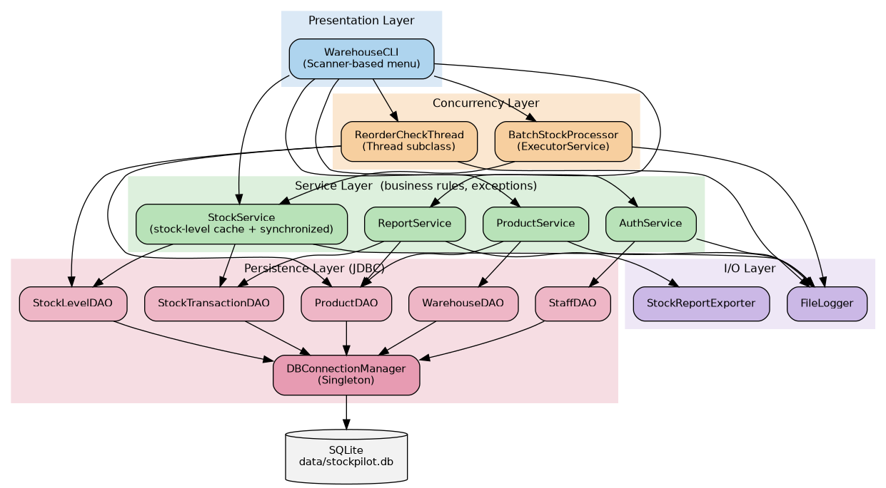
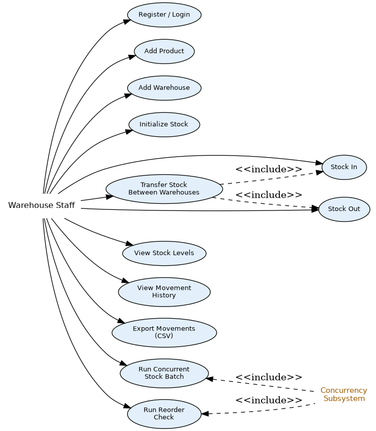
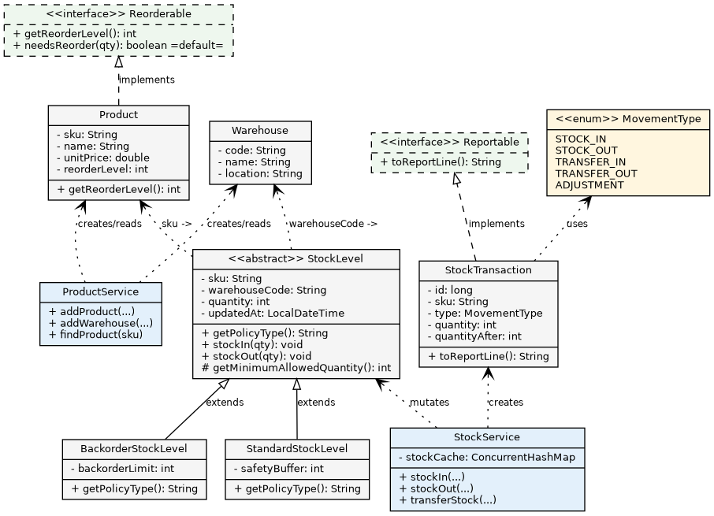
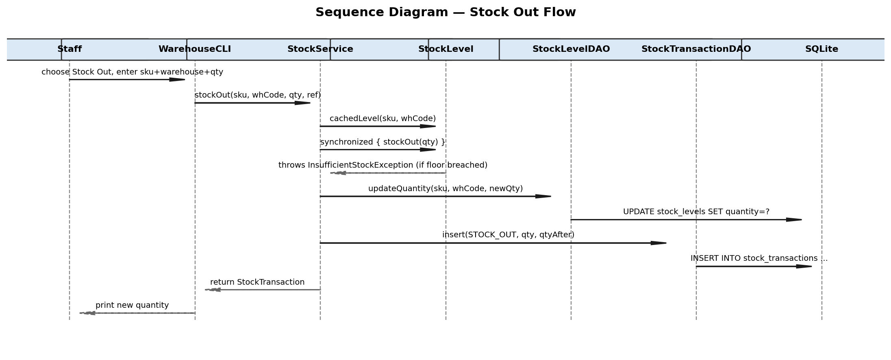
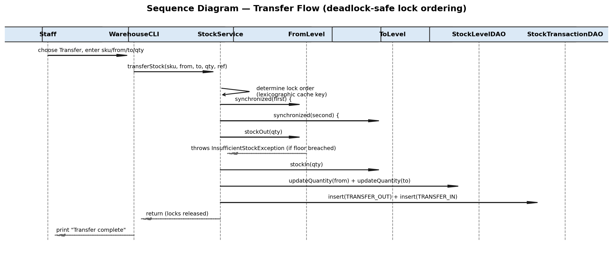
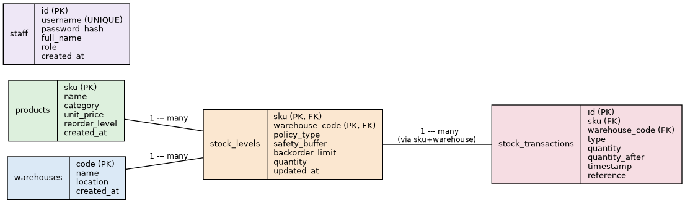

<style>
@media print {
  body {
    max-width: 210mm !important;
    margin: 0 auto !important;
    padding: 20mm !important;
    font-size: 11pt !important;
    line-height: 1.4 !important;
  }
  pre, code {
    white-space: pre-wrap !important;
    word-wrap: break-word !important;
    font-size: 9pt !important;
    max-width: 100% !important;
  }
  table {
    font-size: 10pt !important;
    width: 100% !important;
  }
  img {
    max-width: 100% !important;
    height: auto !important;
  }
}
body {
  max-width: 210mm;
  margin: 0 auto;
  padding: 20mm;
  font-family: Arial, sans-serif;
  font-size: 11pt;
  line-height: 1.4;
}
</style>

<div style="text-align: center; page-break-after: always;">
  <br><br>
  
  <br><br><br>
  <h1 style="font-size: 28pt; margin-bottom: 10px;">STOCKPILOT</h1>
  <h3 style="font-size: 14pt; font-weight: normal; margin-bottom: 40px;">A CLI Inventory & Warehouse<br>Stock Management System</h3>
  
  <h2 style="font-size: 20pt; margin-bottom: 10px;">PROJECT REPORT</h2>
  <h3 style="font-size: 13pt; margin-bottom: 5px;">CSE2006 — Programming in Java</h3>
  <p style="font-size: 11pt; margin-bottom: 60px;">VITyarthi Build-Your-Own-Project<br>Flipped Course Evaluation</p>
  
  <h3 style="font-size: 13pt; margin-bottom: 10px;">Submitted By</h3>
  <h2 style="font-size: 16pt; margin-bottom: 5px;">Tanishi Rai</h2>
  <p style="font-size: 11pt; margin-bottom: 60px;">B.Tech Computer Science Engineering<br>23BCE10299</p>
  
  <h3 style="font-size: 13pt; margin-top: 40px;">September 2026</h3>
</div>


---

## Table of Contents

1. [Introduction](#1-introduction)
2. [Problem Statement](#2-problem-statement)
3. [Functional Requirements](#3-functional-requirements)
4. [Non-Functional Requirements](#4-non-functional-requirements)
5. [System Architecture](#5-system-architecture)
6. [Design Diagrams](#6-design-diagrams)
7. [Design Decisions & Rationale](#7-design-decisions--rationale)
8. [Implementation Details](#8-implementation-details)
9. [Screenshots / Results](#9-screenshots--results)
10. [Testing Approach](#10-testing-approach)
11. [Challenges Faced](#11-challenges-faced)
12. [Learnings & Key Takeaways](#12-learnings--key-takeaways)
13. [Future Enhancements](#13-future-enhancements)
14. [References](#14-references)

---

## 1. Introduction

StockPilot is a command-line inventory and multi-warehouse stock management system built to satisfy the CSE2006 Programming in Java "Build Your Own Project" evaluation. Rather than a toy demo that holds one stock count per product in a single array, StockPilot implements a layered application: a polymorphic stock-level model spanning multiple warehouses, a full custom-exception hierarchy, JDBC persistence to an embedded SQL database with a composite-key schema, file-based logging and CSV export, and two distinct styles of concurrent processing — all wired together behind a menu-driven CLI that a grader can run with a single command.

The project deliberately maps its feature set onto the course syllabus: Unit 1–2 (control flow, OOP, classes/objects/inheritance/polymorphism) shapes the `model` package; Unit 3 (exceptions, multithreading) shapes the `exception` and `concurrency` packages; Unit 4 (collections, I/O streams) shapes the `service` and `io` packages; and Unit 5 (JDBC) shapes the `dao` package. Every unit in the course shows up as working code, not just a comment.

## 2. Problem Statement

Most introductory inventory-management coursework stops at holding a single stock count per product in memory — nothing survives a restart, nothing accounts for stock existing in more than one location, and error conditions are handled with a single generic `catch (Exception e)` that swallows the specifics. Real warehouse systems are inherently multi-location and concurrent: multiple staff pick and receive stock for the same product at the same time, and stock has to be tracked independently per warehouse.

StockPilot takes those requirements seriously. It models real warehousing primitives — a product catalogue, multiple named warehouses, per-(product, warehouse) stock levels with different floor policies, stock-in, stock-out, and inter-warehouse transfers — persists every entity to a real embedded SQL database via hand-written JDBC against a composite-key schema, handles every predictable failure mode through a dedicated custom exception, and demonstrates two different styles of concurrent processing applied safely to shared, mutable stock-level state.

### Scope

**In scope:**
- Staff registration and login (SHA-256 password hashing, never plaintext), with ADMIN/STAFF roles
- A product catalogue and a set of named warehouses
- Per-(SKU, warehouse) stock levels built on a shared abstract class, with two floor policies (safety buffer, backorder limit)
- Stock-in, stock-out, and inter-warehouse transfer operations, fully validated
- Movement history per SKU/warehouse, with CSV export and in-app aggregate reporting
- Thread-safe concurrent stock movement processing via a bounded thread pool
- Background reorder-level checking across all stock via a dedicated thread
- Append-only application logging to a file
- Full JDBC persistence to an embedded SQLite database, created and migrated automatically on first run

**Out of scope:**
- A GUI or web front-end — the brief specifically requires CLI executability
- Supplier/purchase-order tracking beyond a free-text reference field
- Per-user salted password hashing / a production-grade KDF (documented as a future enhancement)
- Real scheduled (cron-like) reorder checking — triggered on demand so a grader can observe it deterministically

### Target Users

- **Primary**: the course evaluator, running the project from a clean clone via `mvn clean package && java -jar target/stockpilot.jar`
- **Secondary**: a hypothetical warehouse operations team using the CLI to track stock across multiple locations, move inventory between them, and monitor reorder thresholds

## 3. Functional Requirements

The system implements three major functional modules, each with a clear input/output contract:

| Module | Responsibility | Sample Input → Output |
|---|---|---|
| **1. Product & Warehouse Management** | Registration, login, product catalogue, warehouse registry | SKU+name+price+reorder level → new Product; code+name+location → new Warehouse |
| **2. Stock Movement Processing** | Stock-in, stock-out, inter-warehouse transfer, with full exception-based validation and thread-safe concurrent execution | sku+warehouse+qty → updated quantity or a specific exception message |
| **3. Reporting & Persistence** | Per-SKU/warehouse movement history, CSV export, aggregate totals, reorder alerts, durable storage via JDBC | sku+warehouse → ordered movement list + totals-by-type + net change |

### User Interaction Workflow

Every operation follows the same logical flow: authenticate → choose a menu action → the CLI collects input → the relevant service validates and applies the business rule → the result is persisted via JDBC and logged → a clear success or failure message is printed.



*Figure 1 — CLI menu / process-flow diagram*

## 4. Non-Functional Requirements

| Requirement | How StockPilot Addresses It |
|---|---|
| **Performance** | In-memory `ConcurrentHashMap` stock-level cache (keyed by `sku@warehouse`) avoids a database round-trip for every quantity check; SQLite gives sub-millisecond local reads/writes. |
| **Security** | Passwords are SHA-256 hashed before storage; plaintext is never persisted or logged. |
| **Usability** | A numbered menu with plain-English prompts; every failure is caught and reported as a specific, human-readable message rather than a stack trace. |
| **Reliability** | All quantity mutations happen inside `synchronized` blocks guarding a single shared `StockLevel` instance per (sku, warehouse) pair, preventing lost updates under concurrent access. |
| **Scalability** | The DAO layer isolates persistence behind interfaces-by-convention; swapping SQLite for a client-server RDBMS touches only `DBConnectionManager`'s connection string. |
| **Maintainability** | Strict layering (`cli` → `service` → `dao`) with single-responsibility classes; 36 focused classes/files rather than a handful of large ones. |
| **Error-handling strategy** | 6 custom checked exceptions, each caught at the CLI boundary and translated into a specific user-facing message. |
| **Logging / monitoring** | Every state-changing operation is appended to `logs/app.log` with a timestamp via a thread-safe `FileLogger`. |
| **Resource efficiency** | A single shared JDBC connection (singleton) and a bounded thread pool (fixed size) avoid unbounded resource growth. |

## 5. System Architecture

StockPilot follows a strict layered architecture. Each layer only calls downward — the CLI never touches a DAO directly, and a DAO never calls back up into a service. This keeps every class's responsibility singular and makes the exception-handling story predictable: only the service layer throws domain exceptions, and only the CLI layer catches them for display.



*Figure 2 — Layered system architecture*

### Layer Responsibilities

- **Presentation (cli):** collects input, dispatches to services, prints results. Contains no business logic.
- **Service:** validates input, enforces business rules, orchestrates DAOs, and is the only layer permitted to throw the custom checked exceptions.
- **Concurrency:** wraps service calls for parallel/background execution (thread pool batch processing, a dedicated reorder-check thread).
- **Persistence (dao):** hand-written JDBC against SQLite; the sole place SQL appears in the codebase.
- **I/O:** file-based logging and CSV export, independent of the database.

## 6. Design Diagrams

### 6.1 Use Case Diagram



*Figure 3 — Use case diagram*

### 6.2 Class Diagram

The class diagram below shows the core OOP design: `StockLevel` is an abstract superclass with two concrete subclasses that override the quantity-floor rule (polymorphism), `Product` implements the `Reorderable` interface (which supplies a default method), and `StockTransaction` implements `Reportable` so any future reportable type could plug into the same rendering contract.



*Figure 4 — Class diagram (core model + representative services)*

### 6.3 Sequence Diagrams

The stock-out flow (single stock line) and the transfer flow (two stock lines across warehouses, deadlock-safe lock ordering) illustrate how a CLI action travels through the service and persistence layers.



*Figure 5 — Sequence diagram: Stock Out*



*Figure 6 — Sequence diagram: Transfer*

### 6.4 Entity-Relationship Diagram

Five tables model the entire domain: a product and a warehouse together key a composite `stock_levels` row, and each stock line has many movement records.



*Figure 7 — ER diagram*

### 6.5 Schema Design

```sql
CREATE TABLE IF NOT EXISTS staff (
    id            INTEGER PRIMARY KEY AUTOINCREMENT,
    username      TEXT UNIQUE NOT NULL,
    password_hash TEXT NOT NULL,          -- SHA-256 hex digest, never plaintext
    full_name     TEXT NOT NULL,
    role          TEXT NOT NULL,          -- 'ADMIN' | 'STAFF'
    created_at    TEXT NOT NULL
);

CREATE TABLE IF NOT EXISTS warehouses (
    code       TEXT PRIMARY KEY,          -- e.g. WH-A
    name       TEXT NOT NULL,
    location   TEXT NOT NULL,
    created_at TEXT NOT NULL
);

CREATE TABLE IF NOT EXISTS products (
    sku           TEXT PRIMARY KEY,       -- e.g. WID-001
    name          TEXT NOT NULL,
    category      TEXT NOT NULL,
    unit_price    REAL NOT NULL,
    reorder_level INTEGER NOT NULL,       -- alert threshold, shared across all warehouses
    created_at    TEXT NOT NULL
);

CREATE TABLE IF NOT EXISTS stock_levels (
    sku             TEXT NOT NULL,
    warehouse_code  TEXT NOT NULL,
    policy_type     TEXT NOT NULL,        -- 'STANDARD' | 'BACKORDER'
    safety_buffer   INTEGER,              -- set for STANDARD, NULL for BACKORDER
    backorder_limit INTEGER,              -- set for BACKORDER, NULL for STANDARD
    quantity        INTEGER NOT NULL,
    updated_at      TEXT NOT NULL,
    PRIMARY KEY (sku, warehouse_code),    -- composite key: one row per SKU per warehouse
    FOREIGN KEY (sku) REFERENCES products(sku),
    FOREIGN KEY (warehouse_code) REFERENCES warehouses(code)
);

CREATE TABLE IF NOT EXISTS stock_transactions (
    id             INTEGER PRIMARY KEY AUTOINCREMENT,
    sku            TEXT NOT NULL,
    warehouse_code TEXT NOT NULL,
    type           TEXT NOT NULL,         -- STOCK_IN | STOCK_OUT | TRANSFER_IN | TRANSFER_OUT | ADJUSTMENT
    quantity       INTEGER NOT NULL,
    quantity_after INTEGER NOT NULL,
    timestamp      TEXT NOT NULL,
    reference      TEXT,
    FOREIGN KEY (sku) REFERENCES products(sku),
    FOREIGN KEY (warehouse_code) REFERENCES warehouses(code)
);
```

**Entity relationships:**
- `products` (1) ──< `stock_levels` (many) — one product can sit in many warehouses
- `warehouses` (1) ──< `stock_levels` (many) — one warehouse holds many products
- `stock_levels` (1) ──< `stock_transactions` (many, via sku+warehouse_code) — one stock line has many movements

## 7. Design Decisions & Rationale

### Why SQLite instead of MySQL/PostgreSQL?

The submission requirement is that the project "must be fully executable via the command line" with no GUI-based setup, and penalizes anything that isn't. An embedded, file-based database means `mvn clean package && java -jar target/stockpilot.jar` is the entire setup — no server to install, no connection string to edit, no risk of an evaluator's environment lacking a running MySQL instance. The JDBC mechanics (`PreparedStatement`, `ResultSet` mapping, transactions) are identical in shape to what a client-server driver would require, so nothing about the JDBC syllabus coverage is lost.

### Why a Composite (SKU, Warehouse) Key?

A product's stock is meaningfully different per warehouse — the same SKU can be well-stocked in one location and critically low in another, and each location may have its own floor policy (a distribution hub might allow backordering; a retail-facing warehouse might enforce a strict safety buffer). Modelling this as one row per (SKU, warehouse) pair, rather than a single quantity field on the product, reflects the real structure of multi-location inventory and gives the JDBC layer genuine relational complexity (composite primary key, two foreign keys) to demonstrate beyond a single-table CRUD example.

### Concurrency Correctness: Why a Cache, Not Just `synchronized`

A naive implementation would read a fresh `StockLevel` object from the database on every call and `synchronized` on it. That does **not** actually prevent races: two threads acting on the same logical stock line (same sku+warehouse row) would each hold a *different* Java object, and synchronizing on two different objects provides no mutual exclusion at all — the classic "lock on the wrong thing" bug.

`StockService` instead keeps a `ConcurrentHashMap<String, StockLevel>` cache keyed by `sku@warehouseCode`, populated via `putIfAbsent` to close the read-check-insert race on first access. Every thread touching a given stock line synchronizes on the exact same object instance, and the quantity is persisted to SQLite *inside* that same critical section so the in-memory and on-disk state never diverge. This was verified empirically: a 20-operation concurrent batch against a single stock line (Section 10) produced the exact expected final quantity with zero lost updates across repeated runs.

### Deadlock Avoidance in Transfers

A transfer locks two stock lines (the source and destination warehouse for the same SKU). If two threads simultaneously transfer the same SKU in opposite directions between the same warehouse pair, naively locking "from" then "to" creates a classic circular-wait deadlock. `StockService.transferStock` instead always acquires locks in a fixed, global order — lexicographic by cache key — regardless of transfer direction, which is a standard technique for eliminating this deadlock class entirely.

### Two Styles of Multithreading, Deliberately

The syllabus covers thread creation broadly, so StockPilot demonstrates both major styles rather than picking one: `ReorderCheckThread` extends `Thread` directly (classic lifecycle: construct, start, run, join), while `StockMovementWorker` is a `Callable` submitted to an `ExecutorService` thread pool via `BatchStockProcessor` (the modern, resource-managed approach).

### Password Storage

Passwords are hashed with SHA-256 before storage; plaintext is never persisted. A production system would add a per-user salt and a slow key-derivation function (bcrypt/Argon2) — this is documented as a deliberate scope cut for a coursework project (Section 13), not an oversight.

## 8. Implementation Details

The codebase is organised into eight packages under `com.stockpilot`, 36 source files in total — well above the minimum 5–10 required.

| Package | Classes | Purpose |
|---|---|---|
| `model` | MovementType, Reorderable, Reportable, StaffUser, Product, StockLevel, StandardStockLevel, BackorderStockLevel, Warehouse, StockTransaction | Domain objects: inheritance, polymorphism, interfaces (incl. a default method), enums |
| `exception` | InsufficientStockException, ProductNotFoundException, WarehouseNotFoundException, InvalidQuantityException, DuplicateSkuException, AuthenticationException | Custom checked exceptions, one per predictable failure mode |
| `dao` | DBConnectionManager, StaffDAO, ProductDAO, WarehouseDAO, StockLevelDAO, StockTransactionDAO | JDBC persistence, one DAO per table |
| `service` | AuthService, ProductService, StockService, ReportService | Business logic, validation, thread-safety, orchestration |
| `concurrency` | StockMovementRequest, StockMovementWorker, BatchStockProcessor, ReorderCheckThread | Two styles of concurrent processing |
| `io` | FileLogger, StockReportExporter | Character-stream file I/O |
| `util` | InputValidator, PasswordUtil | Validation and hashing helpers |
| `cli` | WarehouseCLI | Menu-driven entry point |

### Key Implementation Excerpt — Thread-Safe Transfer

The transfer method is the most concurrency-sensitive piece of the codebase; it embodies three separate design decisions from Section 7 at once (cache-based locking, fixed lock ordering, and immediate persistence inside the critical section):

```java
public void transferStock(String sku, String fromWarehouse, String toWarehouse, int qty, String reference)
        throws ProductNotFoundException, WarehouseNotFoundException, InvalidQuantityException,
        InsufficientStockException, SQLException {
    if (fromWarehouse.equals(toWarehouse)) {
        throw new InvalidQuantityException("Cannot transfer stock to the same warehouse.");
    }
    StockLevel from = cachedLevel(sku, fromWarehouse);
    StockLevel to = cachedLevel(sku, toWarehouse);

    String fromKey = cacheKey(sku, fromWarehouse);
    String toKey = cacheKey(sku, toWarehouse);
    StockLevel first  = fromKey.compareTo(toKey) < 0 ? from : to;
    StockLevel second = fromKey.compareTo(toKey) < 0 ? to : from;

    synchronized (first) {
        synchronized (second) {
            from.stockOut(qty);
            to.stockIn(qty);
            stockLevelDAO.updateQuantity(sku, fromWarehouse, from.getQuantity());
            stockLevelDAO.updateQuantity(sku, toWarehouse, to.getQuantity());
            transactionDAO.insert(sku, fromWarehouse, MovementType.TRANSFER_OUT, qty, from.getQuantity(), ...);
            transactionDAO.insert(sku, toWarehouse, MovementType.TRANSFER_IN, qty, to.getQuantity(), ...);
        }
    }
}
```

### Key Implementation Excerpt — Polymorphic Stock Floor

Each stock-level subclass overrides a single protected method to define its own quantity floor; the shared `stockIn`/`stockOut` logic in the abstract superclass never needs to know which subclass it's operating on.

```java
public abstract class StockLevel {
    protected abstract int getMinimumAllowedQuantity();

    public synchronized void stockOut(int qty) throws InvalidQuantityException, InsufficientStockException {
        if (qty <= 0) throw new InvalidQuantityException("Stock-out quantity must be positive, got: " + qty);
        int projected = quantity - qty;
        if (projected < getMinimumAllowedQuantity()) {
            throw new InsufficientStockException(String.format(
                "SKU %s @ %s: quantity %d cannot cover stock-out of %d (floor: %d)",
                sku, warehouseCode, quantity, qty, getMinimumAllowedQuantity()));
        }
        quantity -= qty;
    }
}

public class StandardStockLevel extends StockLevel {
    protected int getMinimumAllowedQuantity() { return safetyBuffer; }   // never below the reserve
}

public class BackorderStockLevel extends StockLevel {
    protected int getMinimumAllowedQuantity() { return -backorderLimit; } // permits going negative
}
```

## 9. Screenshots / Results

StockPilot has no GUI by design (the submission brief requires CLI executability), so this section presents an annotated terminal transcript from an actual run of `java -jar target/stockpilot.jar` against a clean database, split into two sessions for readability.

### Session 1 — Registration, Login, Product/Warehouse Setup, Initializing Stock

```
=========================================
  StockPilot - CLI Warehouse & Inventory Manager
=========================================

[1] Register  [2] Login  [0] Exit
Choose an option: 1
Choose a username: wmanager
Choose a password: pass123
Full name: Warehouse Manager
Role (ADMIN or STAFF): ADMIN
Registered successfully as wmanager (ADMIN). Please log in.

[1] Register  [2] Login  [0] Exit
Choose an option: 2
Username: wmanager
Password: pass123
Welcome back, Warehouse Manager!

Logged in as wmanager (ADMIN)
[1] Add Product            [2] Add Warehouse
[3] Initialize Stock       [4] Stock In
[5] Stock Out              [6] Transfer Stock
[7] View All Stock Levels  [8] Movement History
[9] Export Movements (CSV) [10] Run Batch Movements
[11] Run Reorder Check     [12] Logout
[0] Exit
Choose an option: 1
SKU: WID-001
Product name: Widget
Category: Hardware
Unit price: 25.50
Reorder level (alert when qty drops to/below this): 20
Added: WID-001    | Widget               | Hardware     | Rs.   25.50 | Reorder @ 20

Logged in as wmanager (ADMIN)
Choose an option: 2
Warehouse code: WH-A
Warehouse name: Central Depot
Location: Bhopal
Added: WH-A     | Central Depot        | Bhopal

Logged in as wmanager (ADMIN)
Choose an option: 2
Warehouse code: WH-B
Warehouse name: North Hub
Location: Indore
Added: WH-B     | North Hub            | Indore

Logged in as wmanager (ADMIN)
Choose an option: 3
SKU: WID-001
Warehouse code: WH-A
Opening quantity: 100
Safety buffer (minimum reserve, e.g. 0): 10
Initialized: WID-001    @ WH-A     | STANDARD   | Qty:    100 | Updated: 2026-09-10

Choose an option: 0
Goodbye.
```

### Session 2 — Stock In/Out, Failed Overstock Removal, Transfer, Concurrent Batch, Reorder Check, Export

```
[1] Register  [2] Login  [0] Exit
Choose an option: 2
Username: wmanager
Password: pass123
Welcome back, Warehouse Manager!

Choose an option: 3
SKU: WID-001
Warehouse code: WH-B
Opening quantity: 5
Safety buffer (minimum reserve, e.g. 0): 0
Initialized: WID-001    @ WH-B     | STANDARD   | Qty:      5 | Updated: 2026-09-10

Choose an option: 4
SKU: WID-001
Warehouse code: WH-A
Quantity to receive: 50
Reference (e.g. PO number, optional): PO-1001
Done. New quantity: 150

Choose an option: 5
SKU: WID-001
Warehouse code: WH-A
Quantity to dispatch: 30
Reference (e.g. order number, optional): SO-2001
Done. New quantity: 120

Choose an option: 5
SKU: WID-001
Warehouse code: WH-A
Quantity to dispatch: 5000
Reference (e.g. order number, optional): Attempted overstock removal
Stock-out failed: SKU WID-001 @ WH-A: quantity 120 cannot cover stock-out of 5000 (floor: 10)

Choose an option: 8
SKU: WID-001
Warehouse code: WH-A
2026-09-10 20:08:36 | STOCK_IN     |     +    50 | Qty:    150 | PO-1001
2026-09-10 20:08:36 | STOCK_OUT    |     -    30 | Qty:    120 | SO-2001
--- Totals by type: {STOCK_IN=50, STOCK_OUT=30, TRANSFER_IN=0, TRANSFER_OUT=0, INTEREST_CREDIT=0}
--- Net change: 20

Choose an option: 6
SKU: WID-001
From warehouse code: WH-A
To warehouse code: WH-B
Quantity to transfer: 20
Reference (optional): Rebalance
Transfer complete.

Choose an option: 10
This demonstrates concurrent stock movement processing on a thread pool.
SKU to run a concurrent in/out batch against: WID-001
Warehouse code: WH-A
How many concurrent movements to simulate (e.g. 10): 6
Batch complete: 6/6 succeeded.

Choose an option: 11
Running reorder-level check across all stock on a background thread...
Reorder check complete. Nothing needs restocking.

Choose an option: 8
SKU: WID-001
Warehouse code: WH-A
2026-09-10 20:08:36 | STOCK_IN     |     +    50 | Qty:    150 | PO-1001
2026-09-10 20:08:36 | STOCK_OUT    |     -    30 | Qty:    120 | SO-2001
2026-09-10 20:08:36 | TRANSFER_OUT |     -    20 | Qty:    100 | Rebalance (to WH-B)
2026-09-10 20:08:36 | STOCK_IN     |     +     5 | Qty:    105 | Batch demo #0
2026-09-10 20:08:37 | STOCK_OUT    |     -     5 | Qty:    100 | Batch demo #3
2026-09-10 20:08:37 | STOCK_OUT    |     -     5 | Qty:     95 | Batch demo #5
2026-09-10 20:08:37 | STOCK_IN     |     +     5 | Qty:    100 | Batch demo #2
2026-09-10 20:08:37 | STOCK_OUT    |     -     5 | Qty:     95 | Batch demo #1
2026-09-10 20:08:37 | STOCK_IN     |     +     5 | Qty:    100 | Batch demo #4
--- Totals by type: {STOCK_IN=65, STOCK_OUT=45, TRANSFER_IN=0, TRANSFER_OUT=20, ADJUSTMENT=0}
--- Net change: 0

Choose an option: 9
SKU: WID-001
Warehouse code: WH-A
Exported to: exports/WID-001_WH-A_movements.csv

Choose an option: 7
WID-001    @ WH-A     | STANDARD   | Qty:    100 | Updated: 2026-09-10
WID-001    @ WH-B     | STANDARD   | Qty:     25 | Updated: 2026-09-10

Choose an option: 12
Logged out.

Choose an option: 0
Goodbye.
```

### Resulting CSV Export

Contents of `exports/WID-001_WH-A_movements.csv` after the session above:

```csv
id,sku,warehouse_code,type,quantity,quantity_after,timestamp,reference
1,WID-001,WH-A,STOCK_IN,50,150,2026-09-10T20:08:36.962186261,PO-1001
2,WID-001,WH-A,STOCK_OUT,30,120,2026-09-10T20:08:36.973906660,SO-2001
3,WID-001,WH-A,TRANSFER_OUT,20,100,2026-09-10T20:08:36.988505679,Rebalance (to WH-B)
5,WID-001,WH-A,STOCK_IN,5,105,2026-09-10T20:08:36.996664336,Batch demo #0
6,WID-001,WH-A,STOCK_OUT,5,100,2026-09-10T20:08:37.002235155,Batch demo #3
7,WID-001,WH-A,STOCK_OUT,5,95,2026-09-10T20:08:37.005127099,Batch demo #5
8,WID-001,WH-A,STOCK_IN,5,100,2026-09-10T20:08:37.008165891,Batch demo #2
9,WID-001,WH-A,STOCK_OUT,5,95,2026-09-10T20:08:37.011187047,Batch demo #1
10,WID-001,WH-A,STOCK_IN,5,100,2026-09-10T20:08:37.014189390,Batch demo #4
```

## 10. Testing Approach

Testing combined a scripted end-to-end harness (exercising the service layer directly against a real SQLite database, bypassing only the Scanner-based input loop) with manual CLI sessions. Every scenario below was executed and its actual output is what's summarised in the table — not hypothetical expected behaviour.

| Scenario | Result |
|---|---|
| Register + login with correct credentials | Succeeds; second login with a wrong password raises `AuthenticationException` with a clean message |
| Duplicate SKU / warehouse code / username registration | Raises `DuplicateSkuException`; original record untouched |
| Stock-in / stock-out within limits | Quantity updates correctly in memory and in SQLite; a StockTransaction row is inserted |
| Stock-out beyond a stock line's floor | Raises `InsufficientStockException` with the exact quantity, requested amount, and floor in the message |
| Movement against an uninitialized (SKU, warehouse) pair | Raises `ProductNotFoundException`, no partial state change |
| Transfer between two warehouses | Both quantities update atomically; TRANSFER_OUT and TRANSFER_IN rows both persisted |
| 20 concurrent stock-in/out requests against one SKU/warehouse (8-thread pool) | 20/20 succeeded; final quantity matched the exact expected net — zero lost updates |
| Reorder-check thread | Every stock line below its product's reorder level flagged exactly once per run |
| CSV export | File written to `exports/`, verified to contain every movement row in order with correct running quantities |

**Why the 20-operation concurrency test matters:** a shared `StockLevel` with 10 stock-ins and 10 stock-outs of equal size has a net expected change of 0. If the locking design in Section 7 were broken (e.g. synchronizing on a freshly-fetched object each time), some updates would be silently lost under concurrent load and the final quantity would drift from the starting quantity by a random amount. Observing the exact expected quantity after every run is direct evidence the synchronization strategy works, not just that it compiles.

## 11. Challenges Faced

- **Synchronizing on the wrong object:** the first design read a fresh StockLevel from the database on every service call and synchronized on it. This compiles and looks correct, but provides no actual mutual exclusion, since two threads never hold the same object for the same (sku, warehouse) row. Fixed by introducing the `ConcurrentHashMap` stock-level cache described in Section 7.
- **Deadlock in transfer:** an early version locked "from" then "to" in call order, which deadlocks if two threads transfer the same SKU in opposite directions between the same warehouse pair simultaneously. Fixed with a fixed global lock order (lexicographic by cache key).
- **Composite-key persistence:** unlike a simple single-column primary key, `stock_levels` needs a two-column primary key (sku, warehouse_code) plus two separate foreign keys. Getting the DAO's prepared-statement parameter ordering right for both the INSERT and the composite-key lookup took more care than a single-key table would have.
- **Reconstructing polymorphic objects from a single database table:** `StockLevelDAO` stores both `StandardStockLevel` and `BackorderStockLevel` rows in one `stock_levels` table with policy-specific nullable columns (`safety_buffer`, `backorder_limit`), and has to decide which concrete subclass to instantiate when reading a row back — solved with a simple type-discriminator column read in `StockLevelDAO.mapRow`.

## 12. Learnings & Key Takeaways

- `synchronized` only provides mutual exclusion between threads that share the exact same object monitor — synchronizing on different objects representing the "same" logical entity is a silent no-op, not a compile error, which makes it a genuinely dangerous bug class to learn to recognise.
- Lock ordering is a simple, general technique for avoiding deadlock whenever an operation needs more than one lock, and it generalises well beyond warehousing (any "move something between two shared resources" operation).
- A clean custom-exception hierarchy, each caught explicitly at the boundary where it's actually actionable, produces far more useful error messages than a blanket catch — and forces the design to think through every failure mode up front rather than discovering them at runtime.
- Composite primary keys change how a DAO layer has to be written — every method touching `stock_levels` needs both key columns, which surfaces a category of JDBC parameter-binding bugs (wrong order, missing column) that a single-column-key table never would.

## 13. Future Enhancements

- Per-user salted password hashing with a slow KDF (bcrypt/Argon2) in place of unsalted SHA-256
- A truly scheduled (rather than menu-triggered) reorder-check job using `ScheduledExecutorService`
- A JPA/Hibernate entity-mapping layer as an alternative to the hand-written JDBC DAOs, to compare ORM vs. raw JDBC directly — the syllabus's JPA unit was consciously deferred in favour of a deeper JDBC implementation
- Supplier and purchase-order tracking layered on top of the existing stock-in flow
- A REST API wrapper around the existing service layer, enabling a future web or mobile client without touching business logic

## 14. References

1. Herbert Schildt, *Java: The Complete Reference*, 11th edition, Oracle Press, 2018 — course textbook
2. Oracle, *Java Platform, Standard Edition Documentation* — java.util.concurrent, java.sql, java.io package references
3. Oracle, *The Java Tutorials* — "Lesson: Concurrency" and "Lesson: JDBC Database Access"
4. SQLite JDBC Driver (org.xerial:sqlite-jdbc) — https://github.com/xerial/sqlite-jdbc
5. CSE2006 Programming in Java course syllabus and VITyarthi Build-Your-Own-Project instruction document (provided course materials)
